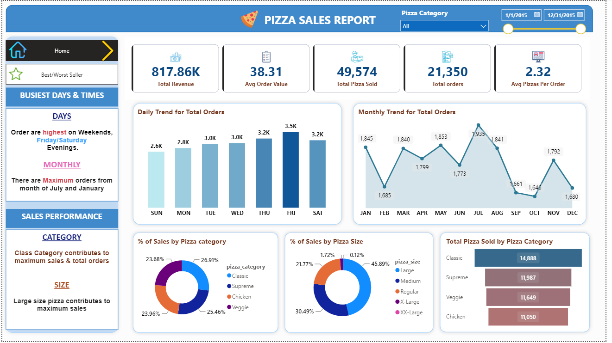

<h1 align="center">Pizza Sales Dashboard</h1>

**Problem Statement:**

Our goal is to analyze the pizza sales dataset to understand customer ordering patterns, identify paek sales periods and find out which pizza sizes and categories
drive the most revenue.

**Insights derived from the data:**

* Classic is the most selling pizza category whereas Chicken is the least selling category.

* Customers prefer the Large (L) size of pizza the most, making up nearly 46% of all sales.

* The average order value is $38.31 with an average of about 2 pizzas per order.

* Customers prefer to order the most on weekends, specifically on Friday and Saturday evenings.

* July and January are the peak months for total orders.

  
